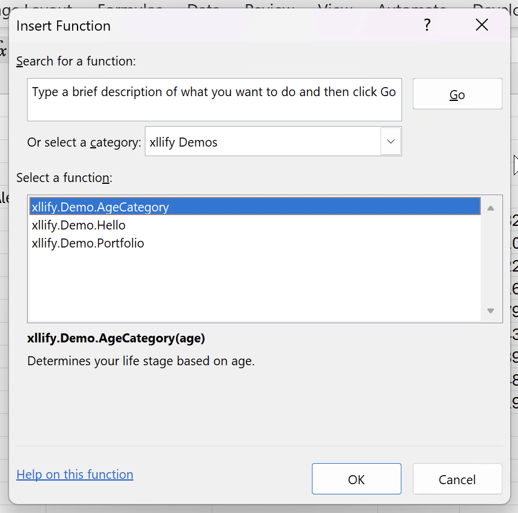
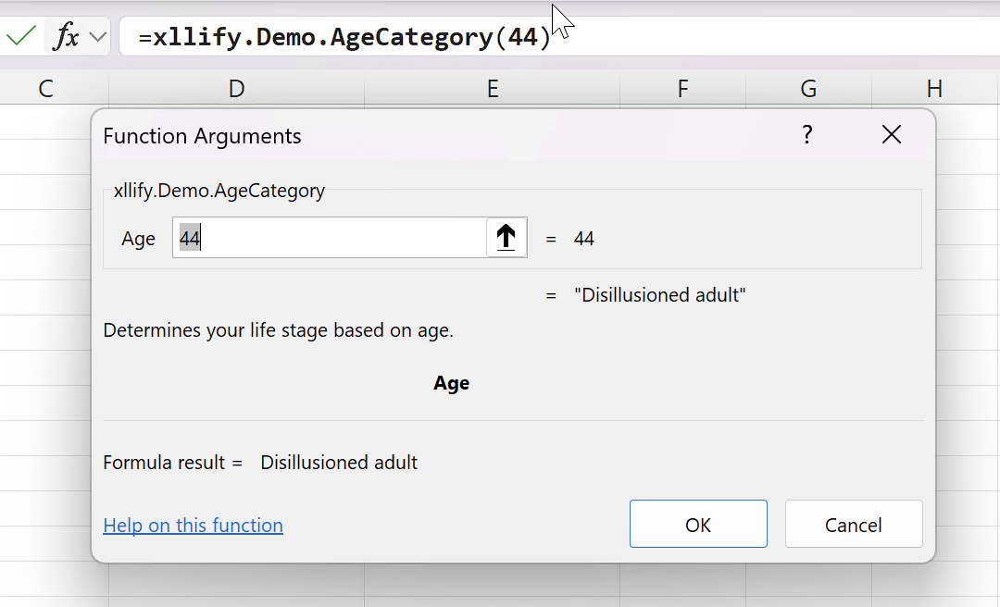
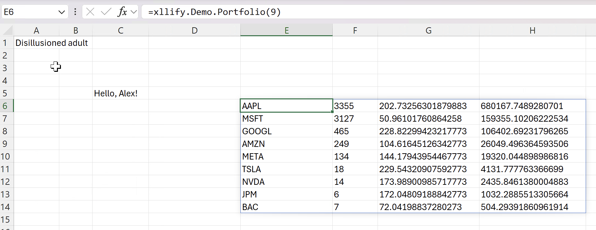

# xllify-demo

This repo demonstrates using xllify and the [xllify-build](https://github.com/marketplace/actions/xllify-build) action to package some simple Luau functions into an .xll. The workflows are defined in [build.yaml](https://github.com/xllifycom/xllify-demo/blob/main/.github/workflows/build.yaml).

You can download pre-built XLLs from the [latest release](https://github.com/xllifycom/xllify-demo/releases/latest).

- xllify_demo.xll - lua functions see [DOCS.md](https://github.com/xllifycom/xllify-demo/blob/main/DOCS.md); see [test sheet for Black Scholes](./benchmark/black_scholes_luau.xlsm)
- xllify_demo_duckdb.xll - see [duckdb/](https://github.com/xllifycom/xllify-demo/blob/main/duckdb)
- xllify_demo_python.xll - see [black_scholes.py](https://github.com/xllifycom/xllify-demo/blob/main/black_scholes.py); see [test sheet for Black Scholes](./benchmark/black_scholes_py.xlsm)
- xllify_perftest_luau.xll - see [perftest/luau/](https://github.com/xllifycom/xllify-demo/blob/main/perftest/)
- xllify_perftest_python.xll - see [perftest/python/](https://github.com/xllifycom/xllify-demo/blob/main/perftest/)

For more information about the action, see https://github.com/xllifycom/xllify-build or the workflow in this repo.

## Further examples

### DuckDB

The [duckdb](./duckdb) directory contains a comprehensive example of integrating DuckDB's analytical capabilities with Excel. This demo showcases:
- In-memory database with 1.25M rows of synthetic stock market data
- Advanced SQL window functions (moving averages, rankings, percentiles)
- Dynamic array results that spill into Excel cells
- Pre-built analytical queries as Excel functions

See the [DuckDB demo README](./duckdb/README.md) for detailed documentation. It is built as xllify_demo_duckdb.xll and is attached to releases.

## perftest

Simple performance test to exercise calling a function 5000 times. The single function implementation `test_func` is just a simple random number generator. Luau and Python versions have been implemented.

The sheet `exercise.xlsx` contains 5000 rows. Change the seed cell to recalculate. This workbook will work for both the luau and Python variants, but not at the same time of course.

- Load exercise.xlsx
- Load xllify_demo_luau.xll or xllify_demo_python.xll
- Observe recalc
- Change seed value
- Observe recalc

Luau uses multithreaded recalculation. Multi-process support for Python is coming soon. (It's actually in the codebase already just not exposed.)

## Installation

After downloading and installing from the [releases page](https://github.com/xllifycom/xllify-demo/releases/latest), Excel should show the shiny new functions.

> Note: you may have to open the .xll file Properties and check the Unblock checkbox.

