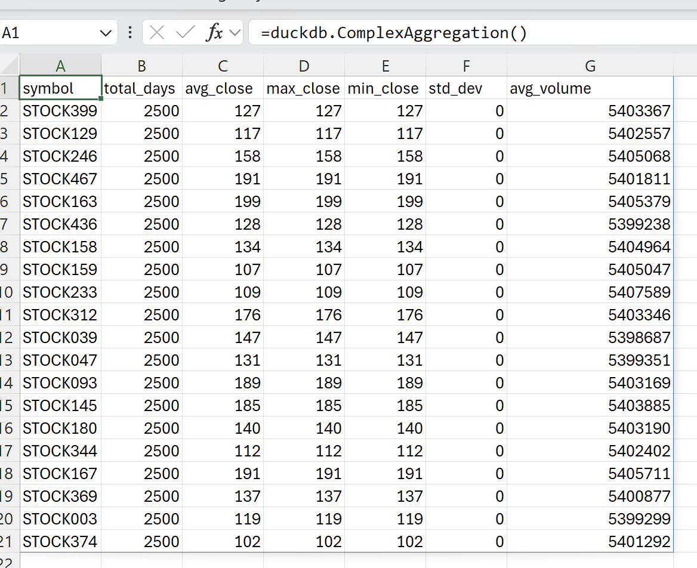

# duckdb

Simple DuckDB powered add-in - runs queries and returns them as a matrix. Creates sample data in-memory upon startup.

```bash
# assumes you're in a venv
pip install -r requirements.txt
xllify duck.xll duckdb_stock_demo.py --py-requirements requirements.txt
```

Open duck.xll in Excel, open a new sheet. 

Start typing `=duckdb.` and the available queries will appear. Try one out! 

```
=duckdb.ComplexAggregation()
```


